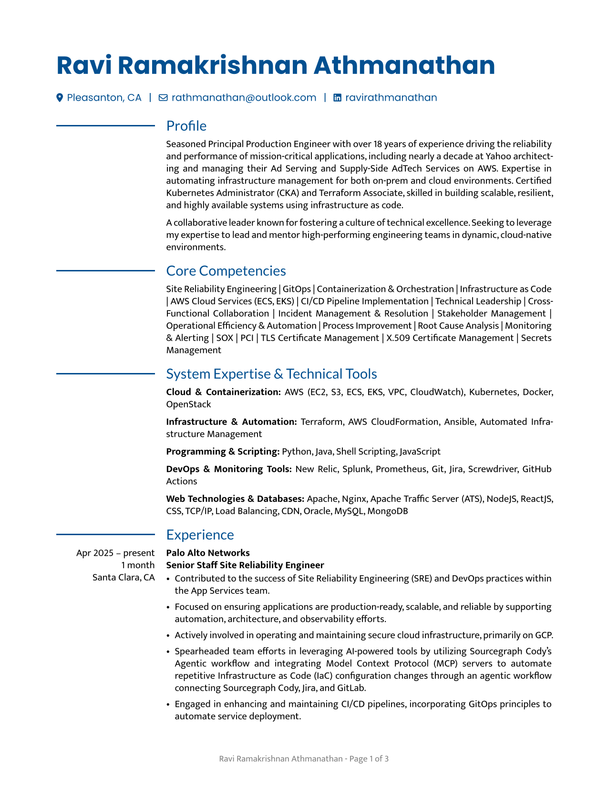
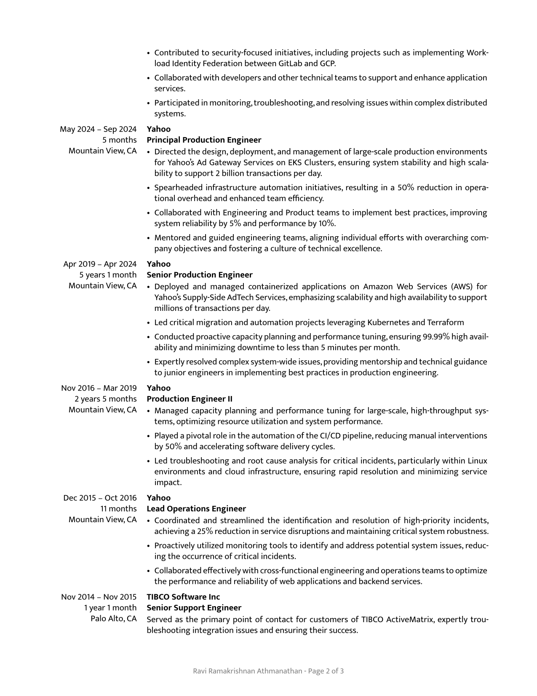

# Ravi Ramakrishnan Athmanathan's Resume

This repository contains the resume of Ravi Ramakrishnan Athmanathan, generated using the [rendercv](https://rendercv.com/) Python library.

## Overview

This resume is created from a YAML data file and rendered into various formats (PDF, HTML, Markdown) using `rendercv`. The primary source of the resume data is [Ravi_Ramakrishnan_Athmanathan_CV.yaml](Ravi_Ramakrishnan_Athmanathan_CV.yaml).

## Repository Structure

The repository is structured as follows:

* `Ravi_Ramakrishnan_Athmanathan_CV.yaml`: Contains all the data for the resume, including personal information, work experience, education, and skills.
* `rendercv_output/`: This directory contains the generated resume in different formats:
    * `Ravi_Ramakrishnan_Athmanathan_CV.pdf`: The resume in PDF format.
    * `Ravi_Ramakrishnan_Athmanathan_CV.html`: The resume in HTML format.
    * `Ravi_Ramakrishnan_Athmanathan_CV.md`: The resume in Markdown format.
* `markdown/`: This directory contains the Jinja2 templates used by `rendercv` to generate the Markdown output.
* `README.md`: The current file, providing an overview of the repository.

## Usage

### Prerequisites

* **Install `rendercv`:**

    ```bash
    pip install rendercv
    ```

### Rendering the Resume

To generate the resume in all specified formats, run the following command:

```bash
rendercv Ravi_Ramakrishnan_Athmanathan_CV.yaml
```

This command will use the data in `Ravi_Ramakrishnan_Athmanathan_CV.yaml` and the templates in the `markdown/` directory to create the files in the `rendercv_output/` directory.

## Rendered Resume

For quick reference, here is the rendered resume:

**Page 1**



**Page 2**



## Additional Information

* The resume is generated using the "moderncv" theme in `rendercv`.
* The design and layout can be customized by modifying the `Ravi_Ramakrishnan_Athmanathan_CV.yaml` file or by adjusting the Jinja2 templates in the `markdown/` directory.
